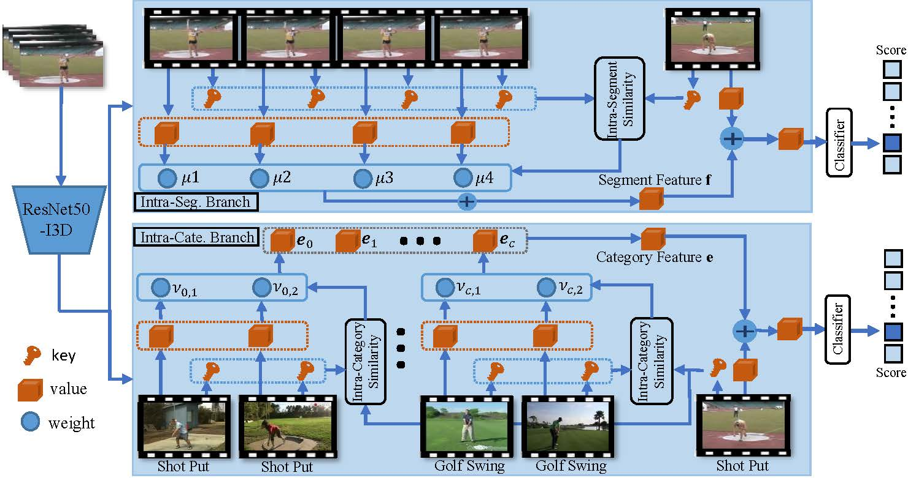

# Colar: Effective and Efficient Online Action Detection by Consulting Exemplars

This repository is the official implementation of Colar. In this work, we study the online action detection and develop an effective and efficient exemplar-consultation mechanism.




## Requirements

To install requirements:

```setup
conda env create -n env_name -f environment.yaml
```

Before running the code, please activate this conda environment.
## Data Preparation

a. Download pre-extracted features from [baiduyun](https://pan.baidu.com/s/1U6G4h9JsSUXRUl7I79jEDg) (code:cola)

~~~~
Please ensure the data structure is as below

├── data
   └── thumos14
       ├── Exemplar_Kinetics
       ├── thumos_all_feature_test_Kinetics.pickle
       ├── thumos_all_feature_val_Kinetics.pickle
       ├── thumos_test_anno.pickle
       ├── thumos_val_anno.pickle
       ├── data_info.json
~~~~

## Train 

a. Config

Adjust configurations according to your machine.

`./misc/init.py`

c. Train

```train
python main.py
```
## Inference

a. You can download pre-trained models from [baiduyun](https://pan.baidu.com/s/1U6G4h9JsSUXRUl7I79jEDg) (code:cola), and put the weight file in the folder `checkpoint`.

- The performance of our model is 66.9% mAP.

b. Test

```eval
python inference.py
```


## Citation

```BibTeX
@inproceedings{yang2022colar,
  title={Colar: Effective and Efficient Online Action Detection by Consulting Exemplars},
  author={Yang, Le and Han, Junwei and Zhang, Dingwen},
  booktitle={Proceedings of the IEEE/CVF Conference on Computer Vision and Pattern Recognition},
  year={2022}
}
```

# Related Projects
- [BackTAL](https://github.com/VividLe/BackTAL): Background-Click Supervision for Temporal Action Localization.

## Contact
For any discussions, please contact [nwpuyangle@gmail.com](mailto:nwpuyangle@gmail.com).
